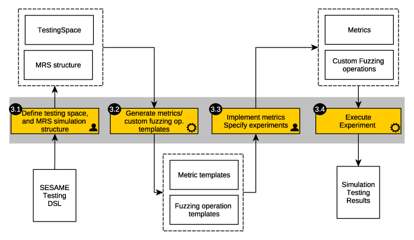

# SOPRANO Simulation-Based Testing Component

This repository presents the installation guide and source code for
the SOPRANO simulation-based testing platform developed for the system.
The software, its design principles and rationale are described in the
SOPRANO deliverable document:

D3.1: Technologies for Safety Analysis and Testing of MH-MR Systems

Further background information is available in the SESAME project deliverables:

- D6.2: Simulation-Based Testing Methodology for EDDIs
- D6.7: Tools for Automated Quality Assurance of EDDI-Supported MRS

The integrated methodology:

The testing architecture:

# Documentation

Documentation and installation instructions for the platform can be found here:
[Documentation for the SOPRANO simulation-based testing platform](./documentation/index.md)

This online guide complements D3.1 in reference to providing
source code and instructions for the platform.
